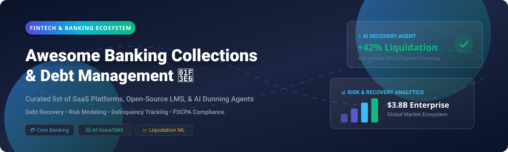

<!-- SEO Meta Keywords: Banking Collections Management, Debt Recovery Software, Delinquent Account Management, AI Collections Agent, Loan Management System LMS, FDCPA Compliance, Credit Management, Fintech Collections -->

<p align="center">
  
</p>

<h1 align="center">🏦 Awesome Banking Collections Management 📉</h1>

<p align="center">
  <b>A Curated List of Enterprise SaaS Platforms &amp; Open-Source Projects for Debt Recovery, AI Collections Automation &amp; Loan Management</b>
</p>

<p align="center">
  <a href="https://github.com/ishandutta2007/Awesome-Awesome-Awesome"></a>
  <a href="https://discord.gg/jc4xtF58Ve"></a>
  <a href="https://awesome.re"></a>
  <a href="https://github.com/ishandutta2007/Awesome-Banking-Collections-Management/blob/main/LICENSE"></a>
  <a href="https://github.com/ishandutta2007/Awesome-Banking-Collections-Management/pulls"></a>
  <a href="https://github.com/ishandutta2007"></a>
</p>

---

## 📌 Table of Contents
- [📊 Sector Market Analysis](#-sector-market-analysis)
- [🏢 SaaS & Hosted Enterprise Platforms](#-saas--hosted-enterprise-platforms)
- [🔓 Open-Source GitHub Projects](#-open-source-github-projects)
- [💡 Architecture & Stack Recommendation](#-architecture--stack-recommendation)
- [🤝 How to Contribute](#-how-to-contribute)
- [⚖️ Legal & Compliance Disclaimer](#-legal--compliance-disclaimer)

---

## 📊 Sector Market Analysis

> 💡 **Market Size & Industry Dynamics**:  
> The global **Banking Collections & Debt Recovery Management Software** market is currently estimated at **$3.8 Billion to $5.2 Billion**, projecting to surpass **$8.5 Billion** by 2030 at a **CAGR of 8.8%**.  
> 
> **Market Structure**: The sector is **moderately to highly fragmented**. Established enterprise IT vendors (such as CGI, FICO, and Finvi) command substantial market share among tier-1 commercial banks, while agile AI-first digital disrupters (TrueAccord, InDebted, Receeve, CollectAI) capture rapid growth in fintech lending, BNPL, and consumer credit with automated SMS/voice recovery engines and machine learning liquidation models.

---

## 🏢 SaaS & Hosted Enterprise Platforms

> Listed below are leading commercial **Collections Management & Debt Recovery SaaS Platforms**, sorted **descending by Company Size & Revenue**.

| 🏢 Platform | 📝 Description | 💰 Starting Pricing | 🎁 Free Tier / Trial Limits | 📈 Company Size / Revenue |
| :--- | :--- | :--- | :--- | :--- |
| **[CGI Collections](https://www.cgi.com/)** | Comprehensive enterprise debt collection and recovery solution covering case management, payment processing, and regulatory compliance. | Starting at $10,000/month enterprise tier (tiered by AR size) | 30-day proof-of-concept sandbox access for financial institutions | **~$11.5B+ Revenue** (CA$15.9B/yr; $25B Market Cap) |
| **[FICO Debt Manager](https://www.fico.com/)** | Enterprise collections and recovery platform with predictive analytics, treatment optimization, and comprehensive case management. | Starting at $15,000/month enterprise platform license fee | 30-day evaluation environment in FICO Analytic Cloud | **~$2.0B+ Revenue** ($45B+ Market Cap) |
| **[Finvi](https://finvi.com/)** | Enterprise collections and recovery software with workflow automation, compliance tools, and payment processing for creditors and agencies. | $399/month starting tier ($699 setup fee for Simplicity Collect); Enterprise from $2,500/month | 14-day free trial (up to 500 accounts) | **~$300M+ Revenue** (Oak Hill Capital Portfolio) |
| **[Indebted](https://indebted.co/)** | AI-powered collections platform focused on optimizing recovery strategies and digital borrower engagement. | 15% – 30% contingency fee on successfully recovered debt | 30-day zero-fixed-fee pilot phase (up to 1,000 accounts) | **US$467M+ Valuation** (A$350M+ Series C; $80M+ Raised) |
| **[Qualco](https://www.qualco.eu/)** | End-to-end collections and debt management platform covering early-stage to late-stage recovery with analytics and workflow automation. | Starting at $5,000/month enterprise base license | 14-day interactive evaluation sandbox upon request | **~$100M – $120M Revenue** (~500+ Employees) |
| **[TrueAccord](https://www.trueaccord.com/)** | AI-powered digital collections platform using machine learning to personalize recovery journeys and improve liquidation rates. | 15% – 35% contingency fee on recovered debt (no collect, no fee) | 30-day proof-of-concept pilot (up to 1,000 accounts) | **~$50M – $75M Revenue** (Raised $78M – $151M VC) |
| **[Pair Finance](https://www.pairfinance.com/)** | Digital debt collection platform using behavioral science and AI to improve recovery rates while maintaining customer relationships. | 12% – 25% commission fee per successfully collected claim | 14-day sandbox test environment for API integration testing | **~$30M – $50M Revenue** (~200+ Employees) |
| **[CollectAI](https://www.collect.ai/)** | AI-driven receivables management platform automating collections communications across email, SMS, and voice channels. | Starting at €1,200/month base platform fee + €0.15/msg | 14-day test environment sandbox with up to 100 test communications | **~$20M – $35M Revenue** (Otto Group / Aareal Ecosystem) |
| **[Katabat](https://katabat.com/)** | Enterprise debt recovery platform with digital engagement, treatment optimization, and compliance management capabilities. | $4,999.99/month starting base plan | 14-day guided sandbox demo with pre-configured customer journeys | **~$15M – $25M Revenue** (Acquired by Finvi) |
| **[Receeve](https://receeve.com/)** | Collections and recovery platform with automated workflows, payment orchestration, and real-time analytics. | Starting at €2,500/month base subscription | 14-day developer sandbox trial with sample debt portfolios | **~$15M – $20M Revenue** (Raised $20M+ VC Funding) |

---

## 🔓 Open-Source GitHub Projects

> Open-source software for self-hosting custom collection workflows, loan management systems (LMS), AI-powered dunning agents, and predictive debt recovery engines. Sorted **descending by GitHub Stars ⭐**.

- **[Apache Fineract](https://github.com/apache/fineract)** [](https://github.com/apache/fineract/stargazers)  
  🏛️ Enterprise Apache-licensed core banking platform with comprehensive loan management capabilities including delinquency buckets, charge-off/charge-back transactions, asset sales, and advanced loan search. Production-proven at scale for financial institutions globally.

- **[Kill Bill](https://github.com/killbill/killbill)** [](https://github.com/killbill/killbill/stargazers)  
  ⚡ Open-source subscription billing, payment orchestration, and dunning engine with customizable overdue payment recovery rules, automated retry logic, and revenue recovery integrations.

- **[Frappe Lending](https://github.com/frappe/lending)** [](https://github.com/frappe/lending/stargazers)  
  📋 Open-source Loan Management System built on ERPNext and Frappe Framework. Covers the entire loan lifecycle from origination to closure, including loan products, collateral management, financial accounting, billing, risk compliance, and co-lending.

- **[loan-management-system](https://github.com/chandachewe10/loan-management-system)** [](https://github.com/chandachewe10/loan-management-system/stargazers)  
  💻 Full-featured web loan management software for managing borrower accounts, repayment schedules, interest calculations, and payment tracking.

- **[LendFlow](https://github.com/Hruthik2311/LendFlow)** [](https://github.com/Hruthik2311/LendFlow/stargazers)  
  🚀 Comprehensive loan management and recovery system built with Node.js/Express backend and React 19 frontend. Features recovery agent assignment, EMI payment tracking, real-time notifications, and admin reporting.

- **[Smart Loan Recovery System](https://github.com/DavieObi/Smart-Loan-Recovery-System)** [](https://github.com/DavieObi/Smart-Loan-Recovery-System/stargazers)  
  🧠 AI-driven solution that predicts loan default risk using Machine Learning, segments delinquent borrowers, and assigns dynamic recovery strategies.

- **[Tira](https://github.com/lgsurith/Tira)** [](https://github.com/lgsurith/Tira/stargazers)  
  🤖 Intelligent AI Collections Agent with self-learning capabilities for debt collection calls built with LiveKit, Supabase, and Google Gemini. Features multi-language support, financial hardship detection, payment agreement tracking, and FDCPA-compliant conversation flows.

- **[Darj Smart Collection](https://github.com/mym1359/darj-smart-collection)** [](https://github.com/mym1359/darj-smart-collection/stargazers)  
  📊 AI-powered debt recovery system based on real-world banking dataset from Maskan Bank. Analyzes customer repayment behavior using XGBoost to predict repayment likelihood and recommend optimal collection strategies.

- **[OpenCBS](https://github.com/Axon-System/opencbsys)** [](https://github.com/Axon-System/opencbsys/stargazers)  
  🏦 Open-source loan tracking software for microfinance institutions. Features client management, loan schedule generation, collateral tracking, custom reporting, and C# backend with PostgreSQL.

- **[Recoverflow](https://github.com/JudyaiLab/recoverflow)** [](https://github.com/JudyaiLab/recoverflow/stargazers)  
  🌐 Cross-border B2B debt recovery multi-agent system featuring a 16-reason Voice Escalation Routing Tree, Concierge SLA Matrix, and live USDC settlement on Circle ARC blockchain.

- **[N8nDebtCollector](https://github.com/MaDhuManodya/N8nDebtCollector)** [](https://github.com/MaDhuManodya/N8nDebtCollector/stargazers)  
  🔄 Automated debt recovery workflow using n8n, AI (OpenRouter), and Supabase/PostgreSQL. Features AI chatbot for debtor interaction and call automation via Twilio/Plivo.

- **[Atlas DCA](https://github.com/fedex-atlas/atlas-dca)** [](https://github.com/fedex-atlas/atlas-dca/stargazers)  
  🎯 AI-driven debt collection platform developed for FedEx Hackathon. Features XGBoost Recovery Prediction Engine trained on 800k+ records with 85% ROC score and event-driven compliance engine.

- **[Prestamos Gota a Gota](https://github.com/ChrithianC5Develop/prestamos-gota-a-gota)** [](https://github.com/ChrithianC5Develop/prestamos-gota-a-gota/stargazers)  
  📱 Loan management system with collection routes system, multi-channel notifications, FastAPI backend, and Streamlit/Kotlin multiplatform client.

- **[Vasool](https://github.com/sriramvarun0636/Vasool)** [](https://github.com/sriramvarun0636/Vasool/stargazers)  
  🛡️ Revenue-recovery agent for Razorpay with a taxonomy-driven safety predicate system and hash-chained receipts for collection auditability.

- **[Outstanding Dashboard](https://github.com/adriansanthosh77/outstanding-dashboard)** [](https://github.com/adriansanthosh77/outstanding-dashboard/stargazers)  
  📈 Open-source payment tracking and analytics platform categorizing customers by payment behavior and providing insights to prevent bad debt.

---

## 💡 Architecture & Stack Recommendation

For fintech startups, microfinance institutions, and software engineers building custom, vendor-independent collections solutions:

```
┌────────────────────────────────────────────────────────────────────────┐
│                   Open-Source Banking Collections Stack                │
├────────────────────────────────────────────────────────────────────────┤
│ 1. Core Loan Management: Apache Fineract OR Frappe Lending            │
│ 2. Predictive Recovery Engine: Darj Smart Collection OR Atlas DCA     │
│ 3. Automated AI Dunning/Voice: Tira AI Agent OR N8nDebtCollector      │
│ 4. Cross-Border & Blockchain: Recoverflow Multi-Agent Engine           │
│ 5. Analytics & Payment Tracking: Outstanding Dashboard                │
└────────────────────────────────────────────────────────────────────────┘
```

---

## 🤝 How to Contribute

1. **Fork** the repository.
2. Add or update entries in `README.md` (maintain standard table and list formats).
3. Include: Project Name, URL, brief factual description, starting pricing, free trial terms, and star count badge.
4. Submit a **Pull Request** with a brief summary of additions.

---

## ⚖️ Legal & Compliance Disclaimer

- **Regulatory Compliance**: All debt collection software, AI dunning agents, and automated calling tools must comply strictly with applicable debt collection regulations (e.g., Fair Debt Collection Practices Act - **FDCPA**, **TCPA**, **GDPR**, and local consumer protection laws).
- **Vendor Independence**: This is a community-curated list and does not constitute an endorsement. Commercial features and open-source models should be audited independently prior to production deployment.

---

<p align="center">
  <b>Made with ❤️ for Banks, Fintech Lenders, Microfinance Institutions &amp; Recovery Agencies</b>
</p>
